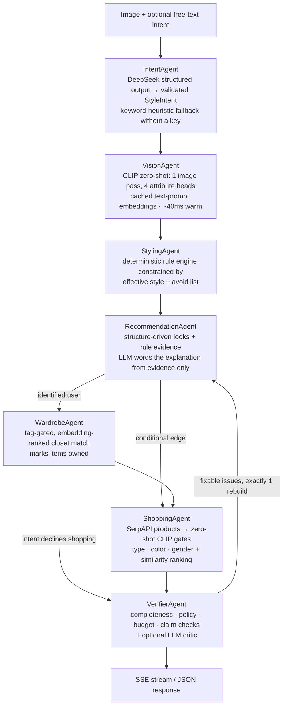

# Synclook AI

An agentic, multimodal fashion-recommendation system: upload a garment photo, optionally say what
you need in plain language ("style this for a rainy dinner under ₹5,000"), and get complete,
verified outfit recommendations with real product links — preferring clothes you already own.

Built as a production-shaped showcase of applied Gen AI engineering: **LangGraph orchestration
with real routing, structured LLM outputs validated by a deterministic rule engine, CLIP
embeddings reused across vision / retrieval / ranking, eval-gated CI, and LLM-as-judge quality
measurement** — every technology earning its place, none included for the buzzword.

## Architecture



The graph is compiled LangGraph (`backend/graph/graph.py`); the `Orchestrator` is a thin façade
that preserves the original REST/SSE contract. Vision failures are fatal, everything downstream
returns partial results, and the intent/wardrobe stages are enhancements that can never break a run.

## The design stance: LLM proposes, rules verify

The LLM is used where language understanding is genuinely needed — parsing free-text intent into a
typed `StyleIntent`, wording explanations, critiquing outfits — and **never** as the authority on
what an outfit may contain. Every LLM output passes deterministic validation (clamping, taxonomy
mapping, policy checks), and the whole system runs without an API key by falling back to
deterministic behavior. The rule engine went from *being the product* to being the guardrails.

## Measured, not claimed

| Metric | Before | After |
|---|---|---|
| Vision latency (warm, per request) | ~15 s (4 CLIP passes + BLIP) | **0.041 s** (1 pass, cached prompts) |
| Empty-recommendation rate (105-case grid) | 8.6% | **0.0%** |
| Product-match F1 (53 labeled products) | 0.839 (keyword matcher) | **0.893** (zero-shot CLIP gates) |
| Product-match precision | 0.743 | **0.862** |
| Explanation faithfulness (LLM-judged) | 0.5 | **1.0** (occasion grounded in evidence) |
| Strict mypy errors | 28 | **0** |

Two honest findings the evals surfaced along the way:

- Naive spec-vs-title cosine similarity scored **worse** than the keyword baseline (F1 0.81 vs
  0.84) — CLIP's text encoder is not a sentence-similarity model. Classifying titles against the
  catalog taxonomy (the same zero-shot heads the vision pipeline uses) is what wins.
- The first LLM-judge run caught the explanation generator citing the user's occasion without it
  being in the evidence — a real grounding bug, fixed by making the occasion an explicit fact.

## Evaluation & observability

- `evaluation/harness.py` — 105-case structural grid (empty-rate, outfit completeness, policy
  violations, duplicates, per-agent latency); `--check` is a CI gate, `--record` persists runs
  with the git SHA.
- `evaluation/product_relevance.py` — labeled product fixtures; reports both matchers so every
  ranking change has a before/after.
- `evaluation/llm_judge.py` — calibration-gated LLM judge for explanation faithfulness and intent
  adherence (scores withheld if the judge can't separate hand-crafted good/bad pairs).
- Langfuse tracing (optional): a trace per analysis, agent-typed spans, per-generation token usage.
- `GET /api/v1/admin/metrics` — confidence distribution, low-confidence rate, feedback like-rate,
  eval-run history.

## Stack

FastAPI · LangGraph · LangChain (structured outputs) · DeepSeek (OpenAI-compatible) · CLIP
(local, one model shared by vision + retrieval + ranking) · PostgreSQL · Redis · SerpAPI ·
Langfuse · Expo React Native frontend · GitHub Actions (ruff, strict mypy, pytest, eval gate)

Deliberate non-choices, argued in [docs/adr/](docs/adr/): no standalone vector DB (embedding
reranking is per-request and in-memory; the wardrobe is small enough that brute-force cosine
beats index round-trips — pgvector is the documented scale-up), no fine-tuning (no data that
would beat zero-shot + retrieval), no LLM-only outfit selection.

## Run it

```bash
# Requirements: Python 3.12, Poetry, PostgreSQL, Redis
poetry install
cp .env.example .env             # add DEEPSEEK_API_KEY / SERPAPI_API_KEY / LANGFUSE keys as desired
poetry run alembic upgrade head
poetry run uvicorn main:app --reload
# → POST /api/v1/analyze  (multipart image, optional user_intent text)
# → POST /api/v1/analyze/stream  (SSE progress per graph node)
# → /docs for the full OpenAPI surface

poetry run python -m pytest tests/ -q          # 226 tests, no models/API/DB needed
poetry run python evaluation/harness.py --check
poetry run python evaluation/product_relevance.py
poetry run python evaluation/llm_judge.py --sample 8   # needs DEEPSEEK_API_KEY

docker compose up                # full stack (app + PostgreSQL + Redis)
```

Everything degrades gracefully: no DeepSeek key → deterministic pipeline; no SerpAPI key → no
shopping stage; no Langfuse keys → tracing no-ops; no image match in your wardrobe → shopping
covers the gap.
